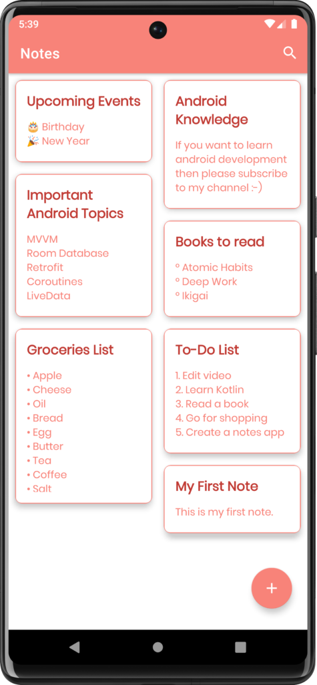
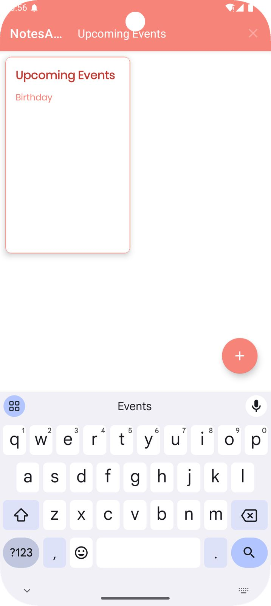
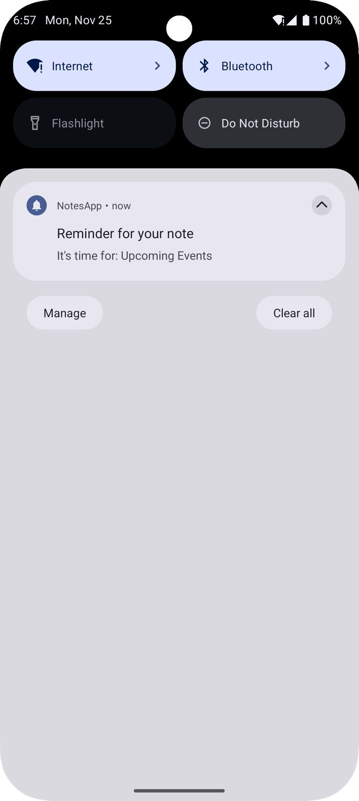
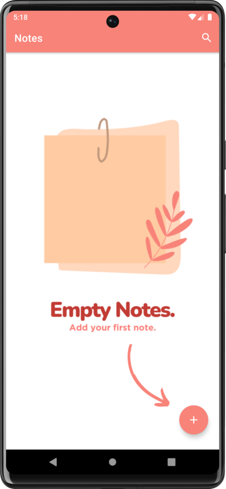
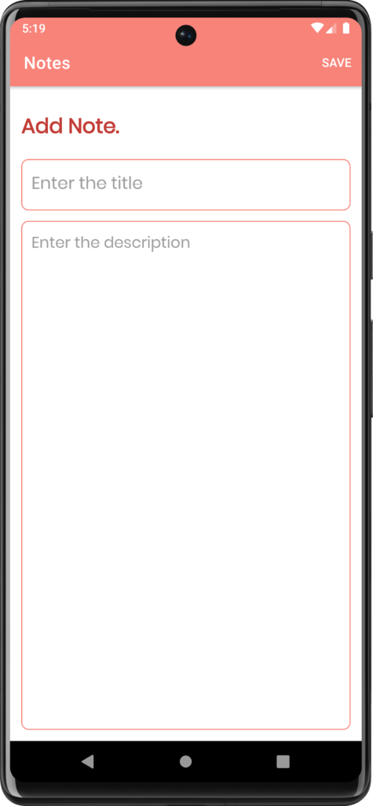
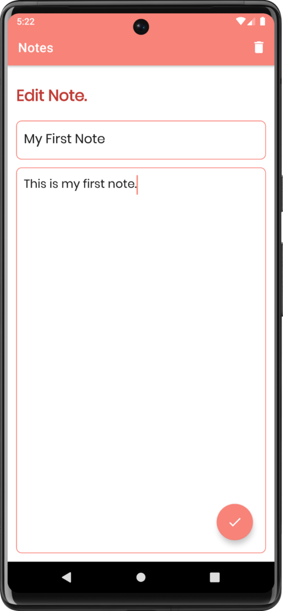

This Android application is a notes-taking app built using the MVVM architecture pattern and Room database for storage. It allows users to create, edit, and delete notes, ensuring data persistence and a smooth user experience. The app leverages modern Android development practices to provide a clean and efficient interface for managing personal notes.

### Pinned Notes

### Searching Notes

### Reminder Notes

## Additional Screenshots

### Feature 1

### Feature 2

### Feature 3

